# 🧠 NDA Analyzer

**NDA Analyzer** is an AI-powered legal assistant that automates the review of Non-Disclosure Agreements (NDAs).  
It extracts and analyzes contractual clauses using LLMs, evaluates compliance against internal policies, and enables
legal teams to validate, reject, and comment on individual clauses through a user-friendly interface.

---

## 🚀 Overview
**APP URL** : https://nda-ui-961479672047.europe-west10.run.app

### ✳️ Core Features

- **Automated clause extraction** from uploaded NDA PDFs.
- **Policy rule matching** using dense vector similarity (ChromaDB).
- **LLM-based reasoning** for compliance, severity, and risk detection.
- **Interactive human feedback** — reject or accept clauses.
- **Chat assistant** providing detailed justifications for LLM evaluations.
- **Persistent data** in a PostgreSQL database.
- **Continuous improvement loop** through rejected clause embeddings.

### Project architecture
```bash
.
├── README.md
├── .github/workflows
│   ├── deploy.yml # Deploy to production environment
│   └── deploy_dev.yml # Deploy to dev environment
├── backend
│   ├── Dockerfile
│   ├── app
│   │   ├── __init__.py
│   │   ├── config.py
│   │   ├── credentials.json # Google Cloud credentials
│   │   ├── db.py
│   │   ├── main.py
│   │   ├── routes
│   │   │    ├── analyze.py
│   │   │    ├── chat.py
│   │   │    ├── documents.py
│   │   │    ├── feedback.py
│   │   │    └── health.py
│   │   └── services
│   │       ├── llm.py
│   │       ├── policy_matcher.py
│   │       ├── rejections_vectorstore.py
│   │       ├── scoring.py
│   │       └── storage.py
│   ├── cloudbuild.yaml
│   └── pyproject.toml
├── examples
│   ├── investor_nda.pdf
│   ├── mutual_nda.pdf
│   └── supplier_nda.pdf
└── ui
    ├── Dockerfile
    ├── pyproject.toml
    └── streamlit_app.py

```
---

## 🧱 Technology Stack

| Layer              | Technology                     | Role                                                                      |
|--------------------|--------------------------------|---------------------------------------------------------------------------|
| **Frontend**       | 🖥️ **Streamlit**              | Interactive dashboard for uploads, analysis visualization, and feedback   |
| **Backend**        | ⚙️ **Flask**                   | REST API serving endpoints `/analyze`, `/documents`, `/chat`, `/feedback` |
| **Database**       | 🐘 **PostgreSQL (Cloud SQL)**  | Stores documents, clauses, predictions, and rejections                    |
| **Vectorstore**    | 🧩 **ChromaDB**                | Stores embeddings of rules and rejected clauses for similarity search     |
| **LLM**            | 🧠 **OpenAI GPT-4o / Mistral** | Analyzes clause meaning and provides compliance reasoning                 |
| **Storage**        | ☁️ **Google Cloud Storage**    | Stores uploaded PDFs, JSON reports, and ChromaDB snapshots                |
| **Infrastructure** | 🚀 **Cloud Run + Cloud Build** | Serverless deployment of the Flask backend via CI/CD                      |
| **CI/CD**          | 🤖 **GitHub Actions**          | Automated build and deployment pipeline                                   |

---

## ⚙️ End-to-End Workflow

### 1️⃣ Upload & Analysis

1. User uploads a PDF via `/analyze` or through the Streamlit interface.
2. The backend extracts textual clauses using PDF parsing.
3. Each clause is embedded and compared against internal compliance rules stored in a **policy vectorstore**.
4. The top-k matching rules are provided to an **LLM prompt** that classifies the clause:
    - **Status** → `OK`, `Needs Review`, `Red Flag`
    - **Severity** → `low`, `medium`, `high`, `critical`
    - **Reason** → LLM-generated textual explanation
5. The results are stored in the **PostgreSQL database** and exported as a JSON report.

### 2️⃣ Storage

- The original PDF and the generated report JSON are uploaded to **Google Cloud Storage**.
- Database relations are created:
    - A `Document` entry summarizing the file and compliance score.
    - `Clause` entries for each extracted segment.
    - `Prediction` entries containing the LLM analysis for each clause.

### 3️⃣ Human Review

- Legal counsel views the document in the **Streamlit UI**:
    - The dashboard shows compliance scores, clause-by-clause results, and reasoning.
    - Each clause can be **rejected** (manual feedback) or **approved**.
    - The entire NDA can be **accepted** or **declined** after review.

### 4️⃣ Feedback Loop

- Rejected clauses are:
    - Saved in the `rejections` table (with comment + timestamp).
    - Embedded and persisted in a **rejections ChromaDB collection**.
- On the next analysis, similar rejections are retrieved and injected into the LLM prompt — enabling continual
  improvement.

### 5️⃣ Chat & Explanations

- The `/chat` endpoint allows clause-specific Q&A:
    - User question + clause text + LLM reasoning + similar rejections.
    - The LLM returns contextual, explainable answers.

---

## 🧠 Backend Logic & Data Flow

```text
   ┌────────────┐       ┌──────────────┐       ┌───────────────┐       ┌──────────────┐
   │  PDF Upload│──────▶│ Flask /analyze│────▶ │ Policy Matcher │────▶ │  LLM Reasoner │
   └────────────┘       └──────────────┘       └───────────────┘       └──────────────┘
         │                                                     │
         ▼                                                     ▼
   Google Cloud Storage                                  PostgreSQL (Documents, Clauses, Predictions)
         │
         ▼
   Streamlit Dashboard  ◀───►  /documents  ◀───►  /chat  ◀───►  /feedback
```

---

## 🧩 System Architecture & Request Flow

```mermaid
flowchart TD

%% === DEPLOYMENT PHASE ===
subgraph Deploy["🚀 Deployment Phase (GitHub Actions → Cloud Run)"]
  A1[👷 GitHub Actions] -->|Builds Docker Image| A2[gcloud builds submit]
  A2 -->|Pushes to Artifact Registry| A3[📦 Container Image]
  A3 -->|Deploys| A4[☁️ Cloud Run Service]
  A4 -->|Warmup| A5["/health" Endpoint]
end

%% === RUNTIME INFRASTRUCTURE ===
subgraph Infra["🧱 Runtime Infrastructure"]
  A4 -->|Connects| DB[(Cloud SQL PostgreSQL)]
  A4 -->|Reads/Writes| GCS[(Google Cloud Storage)]
  A4 -->|Loads| VS[(Chroma Vectorstore)]
end

%% === ANALYSIS FLOW ===
subgraph AnalyzeFlow["📄 /analyze Request Flow"]
  U1[👤 User Uploads PDF via Streamlit or API] -->|POST /analyze| B1[Flask API]
  B1 -->|Check| B2{Vectorstore Loaded?}
  B2 -->|No| B3[Create & Load Policy Vectorstore]
  B2 -->|Yes| B4[Analyze NDA LLM + OCR + Rule Matching]
  B4 --> B5[Compute Compliance Score]
  B5 --> B6[Store Results in PostgreSQL:<br/>documents, clauses, predictions]
  B6 --> B7[Upload PDF + Report to GCS]
  B7 --> B8[Return JSON Report to User]
end

%% === INTERACTION FLOW ===
subgraph Interact["💬 Feedback & Chat"]
  U2[👩‍⚖️ Legal Counsel] -->|GET /documents| C1[List Analyzed NDAs]
  U2 -->|GET /documents/<id>| C2[View Clause-by-Clause Analysis]
  U2 -->|POST /feedback/clauses/<id>/reject| C3[Reject Clause]
  C3 -->|Add Embedding| VS
  U2 -->|POST /chat| C4[Ask LLM About Clause Reasoning]
end

%% === RELATIONSHIPS ===
A4 --> B1
B1 --> DB
B1 --> GCS
C1 --> DB
C2 --> DB
C3 --> DB

%% STYLE SECTION
classDef infra fill:#f3f4f6,stroke:#999,stroke-width:1px;
classDef api fill:#e0f7fa,stroke:#26a69a,stroke-width:1px;
classDef data fill:#fce4ec,stroke:#f06292,stroke-width:1px;
classDef user fill:#fff3e0,stroke:#fb8c00,stroke-width:1px;

class A1,A2,A3,A4,A5 infra;
class DB,GCS,VS data;
class B1,B2,B3,B4,B5,B6,B7,B8 api;
class U1,U2,C1,C2,C3,C4 user;
```



⸻

## 🧩 Database Schema

---

### 🗃️ Table: `documents`

| **Column**           | **Type**               | **Description**                                                             |
|----------------------|------------------------|-----------------------------------------------------------------------------|
| `id`                 | `INTEGER`              | Primary key                                                                 |
| `filename`           | `VARCHAR`              | Original filename of the uploaded NDA                                       |
| `uploaded_at`        | `TIMESTAMP`            | Timestamp of the upload                                                     |
| `total_clauses`      | `INTEGER`              | Number of clauses extracted from the PDF                                    |
| `compliance_score`   | `FLOAT`                | Global compliance score computed from clause-level evaluations              |
| `compliance_details` | `JSON`                 | Detailed breakdown of clause statuses (OK, Needs Review, Red Flag)          |
| `pdf_url`            | `VARCHAR`              | URL of the PDF stored in Google Cloud Storage                               |
| `report_url`         | `VARCHAR`              | URL of the generated JSON report                                            |
| `status`             | `ENUM(DocumentStatus)` | Document status: `to_review`, `safe`, `not_safe`, `accepted`, or `declined` |

**Purpose:**  
Stores metadata and overall compliance summary for each uploaded NDA.

---

### 📄 Table: `clauses`

| **Column**    | **Type**                      | **Description**                               |
|---------------|-------------------------------|-----------------------------------------------|
| `id`          | `INTEGER`                     | Primary key                                   |
| `document_id` | `INTEGER (FK → documents.id)` | Foreign key reference to the parent document  |
| `title`       | `VARCHAR`                     | Clause title or section header                |
| `body`        | `TEXT`                        | Full text of the clause                       |
| `pages`       | `ARRAY[INTEGER]`              | List of page numbers where the clause appears |
| `created_at`  | `TIMESTAMP`                   | Timestamp of extraction                       |

**Purpose:**  
Represents individual clauses extracted from each document.

---

### 🤖 Table: `predictions`

| **Column**        | **Type**                    | **Description**                                                |
|-------------------|-----------------------------|----------------------------------------------------------------|
| `id`              | `INTEGER`                   | Primary key                                                    |
| `clause_id`       | `INTEGER (FK → clauses.id)` | Foreign key reference to the clause                            |
| `best_rule`       | `VARCHAR`                   | Most relevant policy rule matched from vectorstore             |
| `severity`        | `VARCHAR`                   | Severity level: `low`, `medium`, `high`, `critical`            |
| `status`          | `VARCHAR`                   | Compliance classification: `OK`, `Needs Review`, or `Red Flag` |
| `reason`          | `TEXT`                      | Explanation generated by the LLM                               |
| `retrieved_rules` | `JSON`                      | List of policy rules retrieved during semantic search          |
| `llm_evaluation`  | `JSON`                      | Full LLM response for traceability                             |
| `created_at`      | `TIMESTAMP`                 | Timestamp of prediction                                        |

**Purpose:**  
Contains LLM-generated analysis for each clause.

---

### ❌ Table: `rejections`

| **Column**   | **Type**                    | **Description**                                                  |
|--------------|-----------------------------|------------------------------------------------------------------|
| `id`         | `INTEGER`                   | Primary key                                                      |
| `clause_id`  | `INTEGER (FK → clauses.id)` | Foreign key reference to the rejected clause                     |
| `comment`    | `TEXT`                      | Human feedback explaining the reason for rejection               |
| `new_status` | `VARCHAR`                   | Updated clause status after review (`rejected`, `amended`, etc.) |
| `created_at` | `TIMESTAMP`                 | Timestamp of the rejection event                                 |

**Purpose:**  
Logs human corrections and feedback from legal counsels.  
Used to populate the **rejections vectorstore**, improving future analyses.

---

## 🧬 Table Relationships (Summary)

| **From**       | **To**                  | **Relationship**    | **Cardinality** |
|----------------|-------------------------|---------------------|-----------------|
| `documents.id` | `clauses.document_id`   | Document → Clauses  | 1 → N           |
| `clauses.id`   | `predictions.clause_id` | Clause → Prediction | 1 → 1           |
| `clauses.id`   | `rejections.clause_id`  | Clause → Rejections | 1 → N           |

---

**Schema Summary:**

- **4 core tables**: `documents`, `clauses`, `predictions`, `rejections`
- **1→N and 1→1 relationships** enable traceability from NDA → Clause → LLM Evaluation → Human Feedback
- Optimized for **compliance auditing**, **explainability**, and **continuous learning** from feedback.

---

## 🧩 Vectorstores

| **Collection**            | **Description**                                                       | **Location** |
|---------------------------|-----------------------------------------------------------------------|--------------|
| `policy_vectorstore`      | 	Embeddings of internal compliance rules	Config.VECTORSTORE_DIR       |
| `rejections_vectorstore`	 | Embeddings of user-rejected clauses	Config.REJECTIONS_VECTORSTORE_DIR |

Both are persisted locally via ChromaDB and synced to GCS to survive Cloud Run restarts.

---

## 🌐 API Endpoints

The NDA Analyzer backend exposes a RESTful API built with **Flask**.  
Each route is organized by logical domain: analysis, documents, chat, and feedback.

All responses are in **JSON**, and all endpoints follow REST conventions.  
Authentication is not yet implemented (planned for v2).

---

### 🔍 `/analyze` — Analyze NDA Document

**Method:** `POST`  
**Content-Type:** `multipart/form-data`

**Description:**  
Uploads an NDA (PDF) for clause segmentation, policy matching, LLM evaluation, and compliance scoring.

**Example Request:**

```bash
curl -X POST -F "file=@nda.pdf" https://<API_BASE>/analyze
```

**Response**:

```bash
{
  "filename": "nda.pdf",
  "analysis": [...],
  "total_clauses": 18,
  "compliance": {
    "compliance_score": 87.5,
    "details": {"ok": 14, "review": 3, "red_flag": 1},
    "status": "to_review"
  },
  "storage": {
    "pdf_url": "https://storage.googleapis.com/.../pdfs/nda.pdf",
    "report_url": "https://storage.googleapis.com/.../reports/nda_report.json"
  }
}
```

**Side Effects**:

* Stores analysis results in PostgreSQL (documents, clauses, predictions)
* Loads files to GCS (pdfs/ and reports/ buckets)
* Initializes and loads the policy vectorstore from GCS if missing

---

### 📚 `/documents` — List and Retrieve Documents

`GET /documents`

**Description**:
Lists all analyzed documents from PostgreSQL, ordered by upload date.

**Response**:

```bash
[
  {
    "id": 1,
    "filename": "nda_client_a.pdf",
    "uploaded_at": "2025-10-19T21:00:00Z",
    "compliance_score": 92.1,
    "status": "safe",
    "report_url": "https://storage.googleapis.com/.../nda_client_a_report.json"
  }
]
```

---

`GET /documents/<int:doc_id>`

**Description**:
Returns a detailed view of a document, including clauses, predictions, and rejections.

**Response**:

```bash
{
  "id": 1,
  "filename": "nda_client_a.pdf",
  "uploaded_at": "2025-10-19T21:00:00Z",
  "total_clauses": 18,
  "compliance_score": 92.1,
  "status": "safe",
  "clauses": [
    {
      "id": 101,
      "title": "Confidentiality Term",
      "body": "This NDA covers all proprietary information disclosed...",
      "pages": [2, 3],
      "prediction": {
        "status": "OK",
        "severity": "low",
        "reason": "Clause includes perpetual confidentiality.",
        "best_rule": "Confidentiality Coverage",
        "retrieved_rules": [...]
      },
      "rejections": [
        {"id": 12, "comment": "Missing survival clause", "new_status": "rejected"}
      ]
    }
  ]
}
```

---

### 💬 `/chat` — Clause-aware Assistant

**Method:** `POST`  
**Content-Type:** `application/json`

**Description**:
Allows the user to query the LLM interactively about a specific clause and reasoning.

**Request**:

```bash
{
  "question": "Why is this clause risky?",
  "clause": "This agreement is governed by the laws of Delaware...",
  "reason": "The jurisdiction clause may create litigation risk."
}
```

**Response**:

```bash
{
  "answer": "This clause was flagged due to limited jurisdiction flexibility.
Similar clauses were previously rejected by counsel.
Consider changing to a neutral jurisdiction or arbitration clause."
}
```

**Backend Logic**:

* Builds contextual prompt with clause text, llm evaluation reasons, and user question.
* Opionally includes retrieved rejected clauses from the rejections vectorstore.
* Calls OpenAI GPT-4o-mini for explanation or suggestion.

---

### 📝 `/feedback` — Legal Feedback & Continuous Learning

Handles user feedback and approval flows.

---

`POST /feedback/documents/<int:doc_id>/accept`

**Description:** Marks a document as accepted after human review.

**Response**:

```bash
{"message": "Document nda_client_a.pdf marked as accepted"}
```

---

`POST /feedback/documents/<int:doc_id>/decline`

**Description:** Marks a document as declined after legal review.

**Response:**

```bash
{"message": "Document nda_client_a.pdf marked as declined"}
```

---

`POST /feedback/clauses/<int:clause_id>/reject`

**Description:** Stores manual feedback for a rejected clause and updates the rejections vectorstore.

**Request**:

```bash
{
  "comment": "Clause too vague on data retention",
  "new_status": "rejected"
}
```

**Response:**

```bash
{
  "message": "Clause 45 rejected",
  "rejection_id": 102,
  "timestamp": "2025-10-19T22:03:12Z"
}
```

**Backend Logic:**

* Saves the feedback in PostgreSQL (rejections table)
* Adds clause embedding and comment to rejections_vectorstore
* Syncs updated Chroma index to GCS for persistence

---

### 🩺 `/health` — Service Health Check

**Method:** `GET`  
**Content-Type:** `application/json`

**Description:**  
Simple health check endpoint used for Cloud Run warmup and deployment validation.  
It ensures the **policy vectorstore** is initialized and ready before serving analysis requests.

**Response Example:**

```json
{
  "status": "ok",
  "vectorstore_loaded": true
}
```

**Usage Example (in CI/CD):**

```bash

curl -s https://<API_BASE>/health
```

**Behavior:**

* Calls ensure_vectorstore_loaded() internally to verify embeddings are available.
* Returns HTTP 200 if service and vectorstore are operational.

---

### ⚙️ Summary Table

| Category      | 	Method | 	Endpoint                          | 	Description                                           |
|---------------|---------|------------------------------------|--------------------------------------------------------|
| 📄 Documents	 | GET	    | `/documents`	                      | List all analyzed NDAs                                 |
| 📄 Documents	 | GET	    | `/documents/<id>`                  | 	Retrieve one document with all clauses                |
| ⚙️ Analysis	  | POST	   | `/analyze`                         | 	Upload and analyze new NDA PDF                        |
| 💬 Chat	      | POST	   | `/chat	`                           | Ask questions about a clause                           |
| ✅ Feedback	   | POST	   | `/feedback/documents/<id>/accept`  | 	Mark NDA as accepted                                  |
| ❌ Feedback    | 	POST	  | `/feedback/documents/<id>/decline` | 	Mark NDA as declined                                  |
| 🚫 Feedback	  | POST    | 	`/feedback/clauses/<id>/reject`	  | Reject a specific clause and log it in the vectorstore |
| 🩺 Health	    | GET     | 	`/health`	                        | Health Check                                           |

## 🖥️ Streamlit Interface

The **Streamlit dashboard** provides a complete visual and interactive layer on top of the Flask API and database.  
It’s designed for **legal counsels and compliance officers** to quickly assess NDA risk, approve or reject clauses, and
understand LLM reasoning.

---

### 📂 Documents Tab

**Purpose:** Manage and review analyzed NDAs.

**Features:**

- Upload new NDA PDFs (triggers `/analyze` endpoint).
- View the list of all analyzed NDAs stored in PostgreSQL.
- Inspect metadata (filename, upload date, compliance score, status).
- **Accept** or **Decline** a document after review.
- Direct access to the associated report (JSON) and source PDF.

**Statuses:**
| Status | Meaning |
|--------|----------|
| 🟡 `to_review` | Waiting for legal review |
| 🟢 `safe` / `accepted` | No issues detected or validated |
| 🔴 `not_safe` / `declined` | Non-compliant NDA or rejected by counsel |

---

### 📊 Analysis Tab

**Purpose:** Deep-dive into a specific NDA’s clauses.

Each clause includes:

- **Clause text** with page reference and title
- **LLM prediction** (status, severity, and reasoning)
- **Policy rules** retrieved from the vectorstore
- **Rejection button** (to trigger manual feedback)

#### Clause Rejection

When a user clicks **“Reject Clause”**, a comment can be entered explaining the reason for rejection.  
The system:

1. Saves the rejection in PostgreSQL (`rejections` table).
2. Embeds the clause text and stores it in **ChromaDB (`rejections_vectorstore`)**.
3. Syncs the updated vectorstore with GCS for persistence.
4. Future analyses will retrieve similar rejected clauses to refine the model’s behavior.

---

### 💬 Chat Tab

**Purpose:** Explain and explore clause reasoning interactively.

The chat interface allows users to ask follow-up questions about a clause.  
Example questions:

- “Why did the model consider this clause risky?”
- “Suggest safer wording aligned with company policy.”
- “Which rule triggered this red flag?”

**Backend logic:**

- Sends the question, clause text, and reasoning to the `/chat` endpoint.
- The backend retrieves similar rejected clauses from the vectorstore.
- Builds a structured LLM prompt combining:
    - The clause text
    - The LLM’s original reasoning
    - The user’s question
    - Any retrieved rejected clauses
- Returns a contextual, human-readable explanation.

**Example response:**
> _“This clause is flagged because it limits confidentiality to only six months.  
> Similar clauses were previously rejected for the same reason. Consider extending to 24 months.”_

---

### ⚙️ Admin Tab (Coming Soon)

**Purpose:** Manage internal rule sets and model retraining.

Planned features:

- Upload a new `policyRules.json` file defining compliance policies.
- Rebuild the **policy vectorstore** from the uploaded rules.
- Trigger retraining or reindexing jobs.
- Manage user feedback integration (audit trail of clause decisions).

**Example UI components:**

- JSON file uploader (for `policyRules.json`)
- “Rebuild Vectorstore” button
- Feedback database overview

---

## 🧩 Feedback Loop Summary

| Step | Component                              | Description                                         |
|------|----------------------------------------|-----------------------------------------------------|
| 1️⃣  | Clause rejected in UI                  | User provides comment (manual correction)           |
| 2️⃣  | `/feedback/<int:clause_id>/reject` API | Records rejection in database                       |
| 3️⃣  | Vectorstore update                     | Clause text embedded into `rejections_vectorstore`  |
| 4️⃣  | Cloud sync                             | Local Chroma index synced to GCS                    |
| 5️⃣  | LLM prompt                             | Similar rejected clauses retrieved in next analysis |
| ✅    | Continuous learning                    | The system improves at spotting unwanted clauses    |

---

## ☁️ Deployment Summary

| Component         | Platform                     | Description                               |
|-------------------|------------------------------|-------------------------------------------|
| **Flask Backend** | Google Cloud Run             | Serverless REST API                       |
| **PostgreSQL DB** | Cloud SQL                    | Persistent relational storage             |
| **Vectorstores**  | ChromaDB + GCS               | Embedding databases (policy + rejections) |
| **Frontend UI**   | Streamlit                    | Hosted app for human interaction          |
| **CI/CD**         | GitHub Actions + Cloud Build | Continuous deployment pipeline            |

The Streamlit app can be deployed either:

- As a **Cloud Run service**, containerized alongside the backend, or
- As a **static frontend** hosted on **Google Cloud Storage** (with backend API calls routed to Cloud Run).

---

## 🔮 Future Directions

- ❌**FIX**❌: if red flag alert on critical severity policies are present
- ❌**FIX**❌: Refactor in OOP style where for the first time /analyze is called we instantiate a PolicyMatcher object
  that loads all. That way multiple /analyze should only load once vectorstores for policy and rejections.
- ❌**FIX**❌: Remove compliance details from `documents` table as it can be retrieved from predictions
- 📂Add PDF Viewer to Streamlit for in-app document reading
- 🫙Add PDF/report.json link to GCS storage
- 🧪Add unit tests
  necessary resources and can be reused for subsequent calls. These materials will be updated periodically.
- 🧬Add ontology graph knowledge for ontology driven RAG (e.g. If a clause mentions "GDPR", link to data privacy rules
  and
  check that should be retrieved in the policy matcher)
- 📈Add evaluation metrics tracking (LLM accuracy over time) --> model drift etc...
- 🧾 Generate full compliance reports (PDF summaries)
- 🔐 Add authentication and role-based access (multi-user support)
- 🧱 Introduce versioning of `policyRules.json` for auditing

---

## 📜 License

MIT © 2025 — Developed by **Benjamin Maheu**

Built with ❤️ using:
> **Flask**, **Streamlit**, **PostgreSQL**, **ChromaDB**, **OpenAI GPT-4o**, and **Google Cloud Platform**
